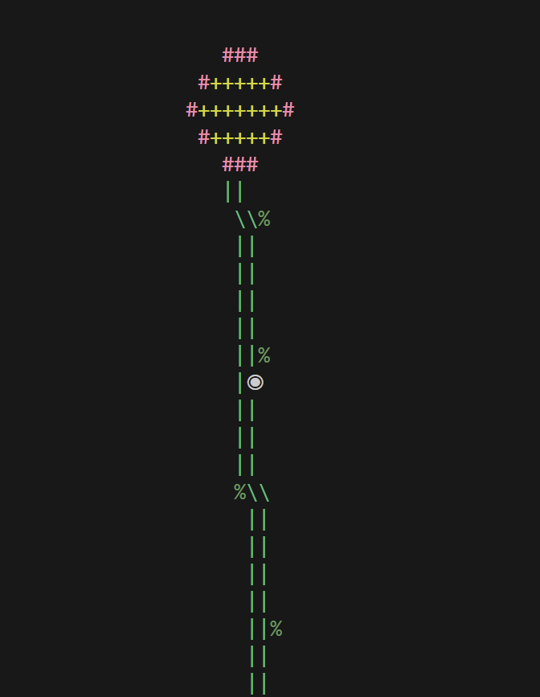

# GitGarden



GitGarden turns your Git commit history into a growing piece of terminal art.  
Every repository starts as a seed and evolves over time — sprouting, flowering, and eventually becoming a tree as your project gains commits.

The goal is simple: make progress visible in a way that feels alive.

---


## How It Works

GitGarden reads your repository’s commit log and draws a plant directly in your terminal:

- **1 commit** → Seed  
- **2–10 commits** → Sprout  
- **11–20 commits** → Flower  
- **21+ commits** → Tree  

Each node represents a commit, and you can move through them to inspect details like the hash, author, date, and message.

---

## Features

- Terminal-based visualization of Git history  
- Interactive navigation between commits  
- Procedurally generated plants (no two look the same)  
- Colorized ANSI output  
- Automatically scales with repository size  

---


## Roadmap

- Branch visualization
- Save plant snapshots as images
- Custom themes
- Display repo contributors as birds
- More wildlife/environment

---

## Contributing

Feel free to open issues for ideas, bugs, or improvements.
Pull requests are welcome. Any additions, especially on the ASCII art, are encouraged. :)

---

## Requirements

- Python 3.7+  
- Git installed and available in your system PATH  
- A terminal that supports ANSI colors
- pip (auto comes with Python)
  
**Cygwin Users:** Make sure you install Python packages inside Cygwin:
```bash
python3 -m pip install --upgrade readchar
```

---

## Installation

Clone the repository:

```bash
git clone https://github.com/ezraaslan/GitGarden.git
cd GitGarden
pip install -r requirements.txt
python main.py

```
---
## Notes
- Tested with Python 3.9+. Earlier versions may work but have not been fully tested.
- If colors look wrong on Windows, use Windows Terminal or enable ANSI support.
